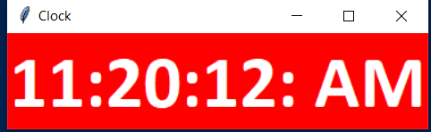
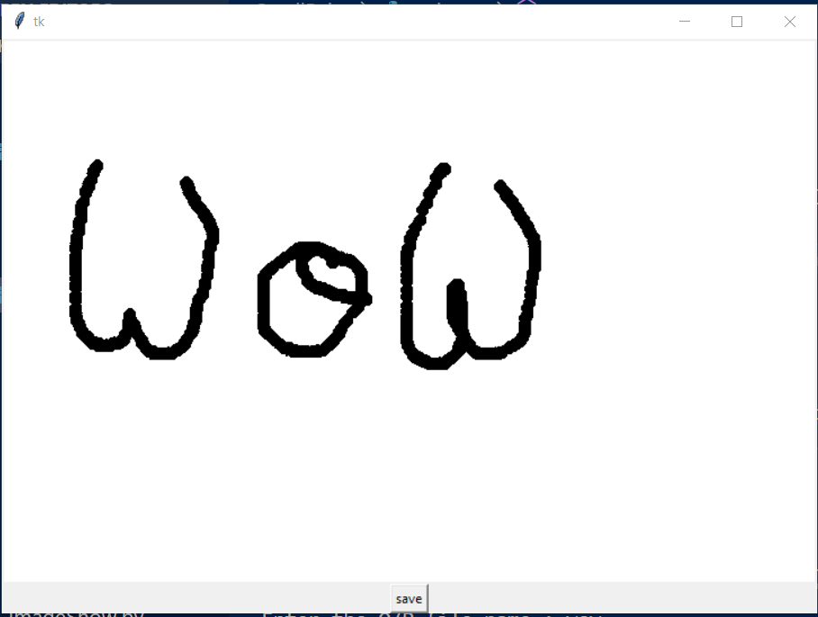
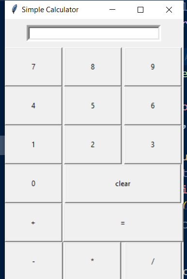
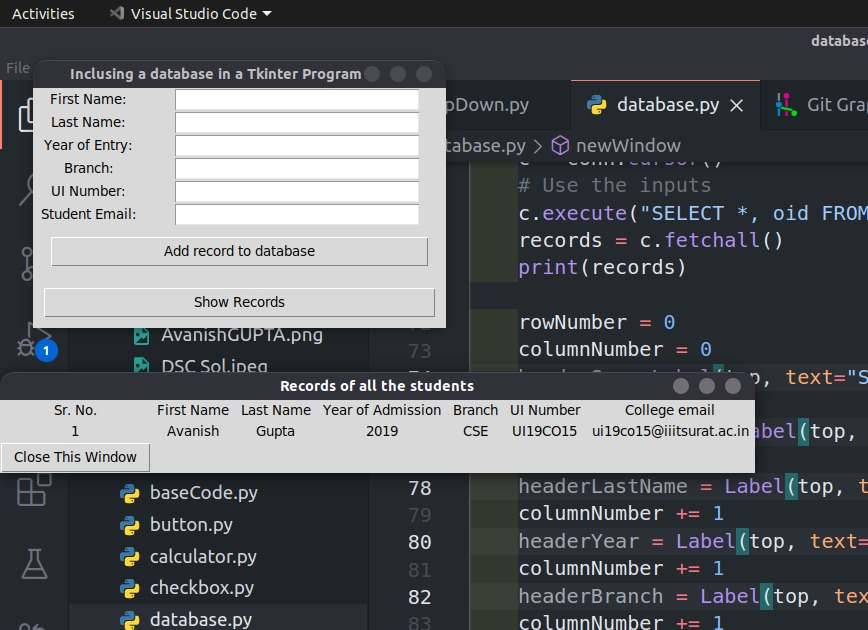

# This is the Description of the Projects in the Repo

## DIGITAL CLOCK

Made using the <em>Tkinter</em> library of python the default GUI libary

## SMALL PAINT

Uses <em>Tkinter</em> and <em>PIL</em> library 

Run <code>pip install pillow</code> in the command line before running the script

## CALCULATOR

Made using the <em>Tkinter</em> library only

## Student Data Management

Made using <em>Tkinter</em> and <em>SQLite3</em>

<ul>
    <li>Adding Data</li>
    <li>Retrieving all data at a time</li>
</ul>

